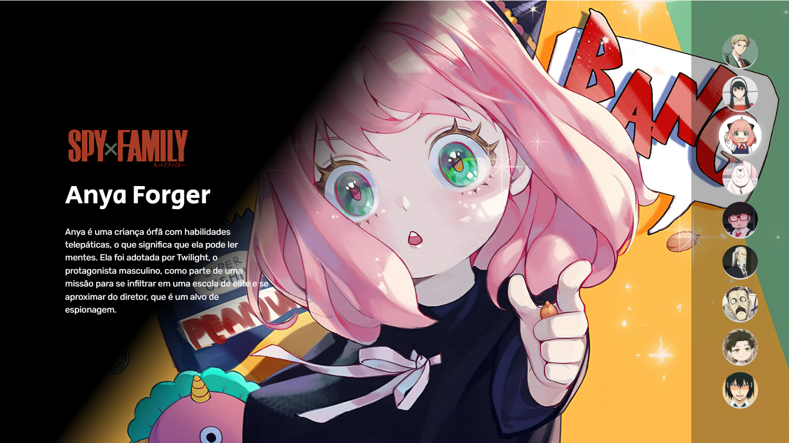

## Spy x Family 

> Spy x Family

Projeto construído com base no Projeto One Piece presente no link:   [Projeto-One-Piece](https://github.com/manusogari/Projeto-One-Piece).

Diferenças - Botões:
- Imagens redimencionadas utilizando CSS
- Transições ao passar o mouse por cima

## [🔗Clique aqui para acessar](https://manusogari.github.io/SpyxFamily/)

## 💻 Tecnologias
- HTML
- CSS
- JavaScript
- Github

## 📧 Contato

medeirosmanuh4@gmail.com